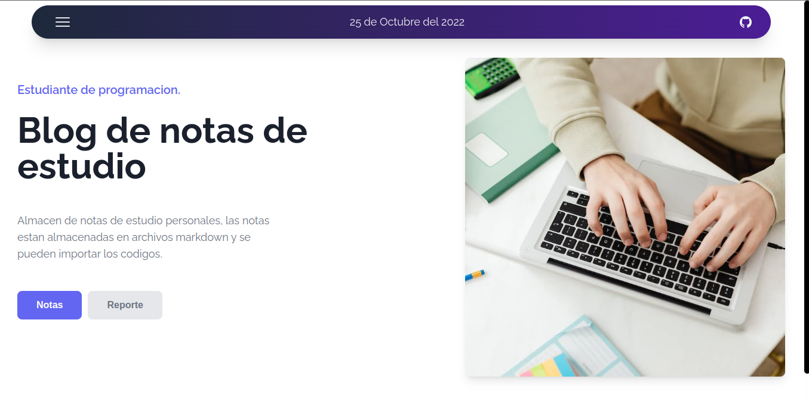
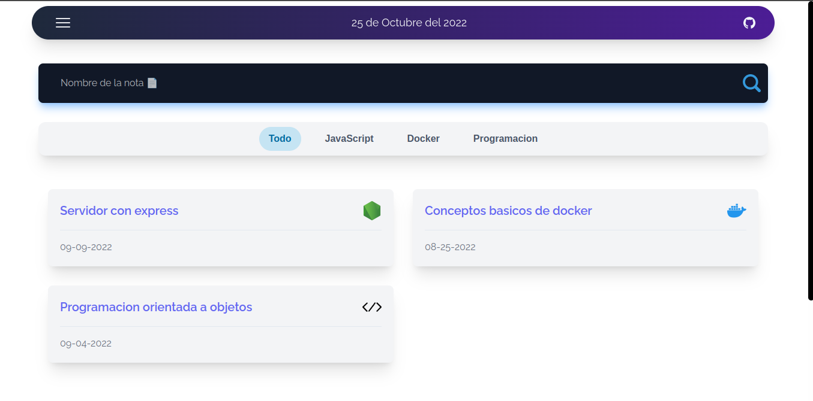
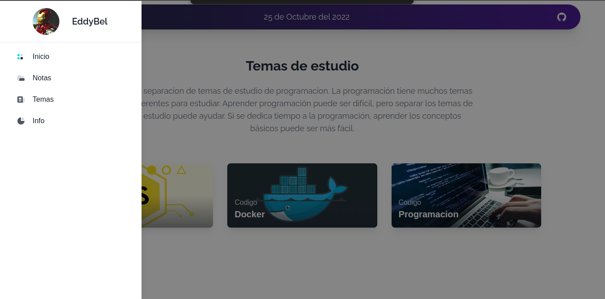
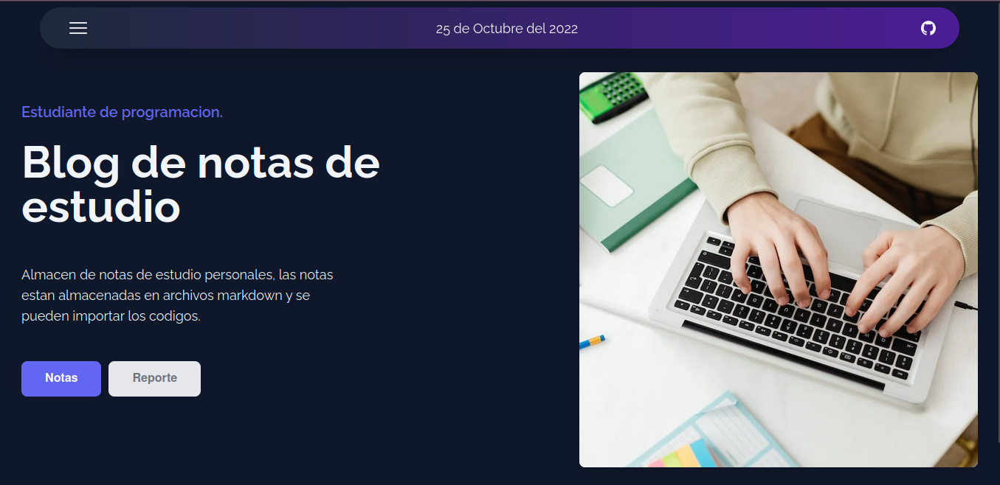
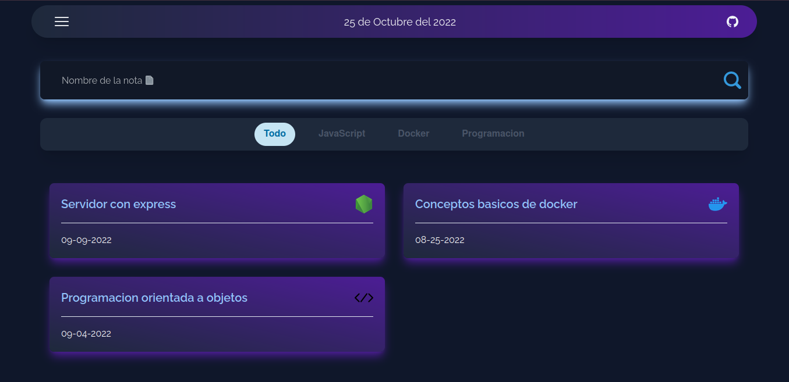
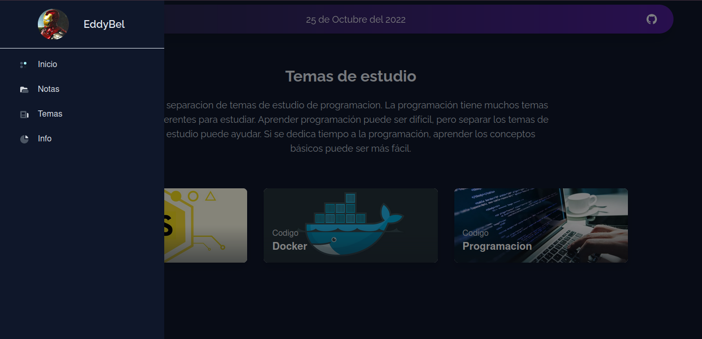

<h1 align="center" >Notebook</h1>

The project is about a website where I can store and display my notes in an easy and simple way. Note files are in markdown and markdown-react format

:link: Notebook https://eddybel.github.io/Notebook/

# View Proyect

#### Light

---

---

#### Dark

---

---

# Technologies

- Javascript
- Sass
- Tailwind
- json
- nextjs
