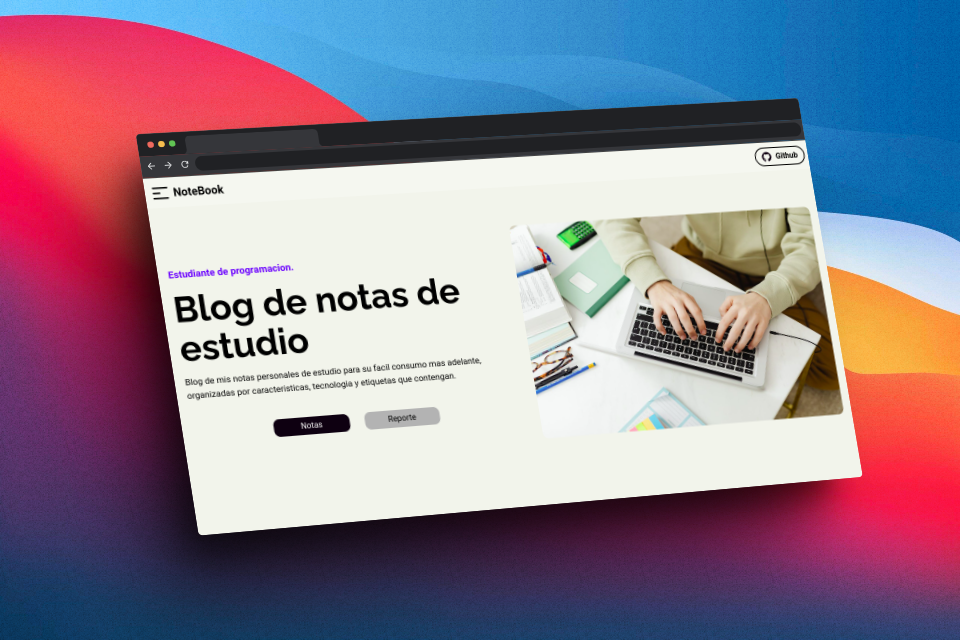

<h1 align="center" >Notebook</h1>

Simple project that reads markdown files and renders them on the web

The project is about a website where I can store and display my notes in an easy and simple way. Note files are in markdown and markdown-react format

# Technologies

- Javascript
- Sass
- Tailwind
- json
- nextjs
